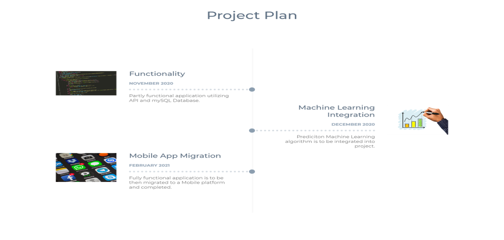
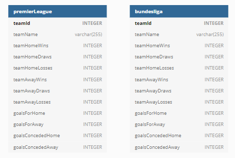
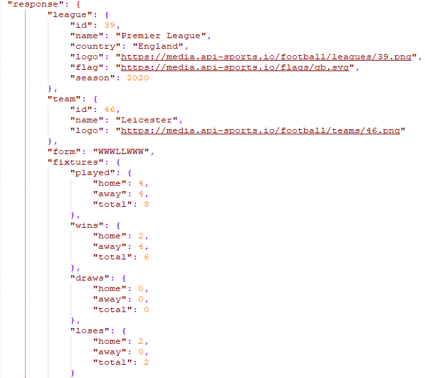
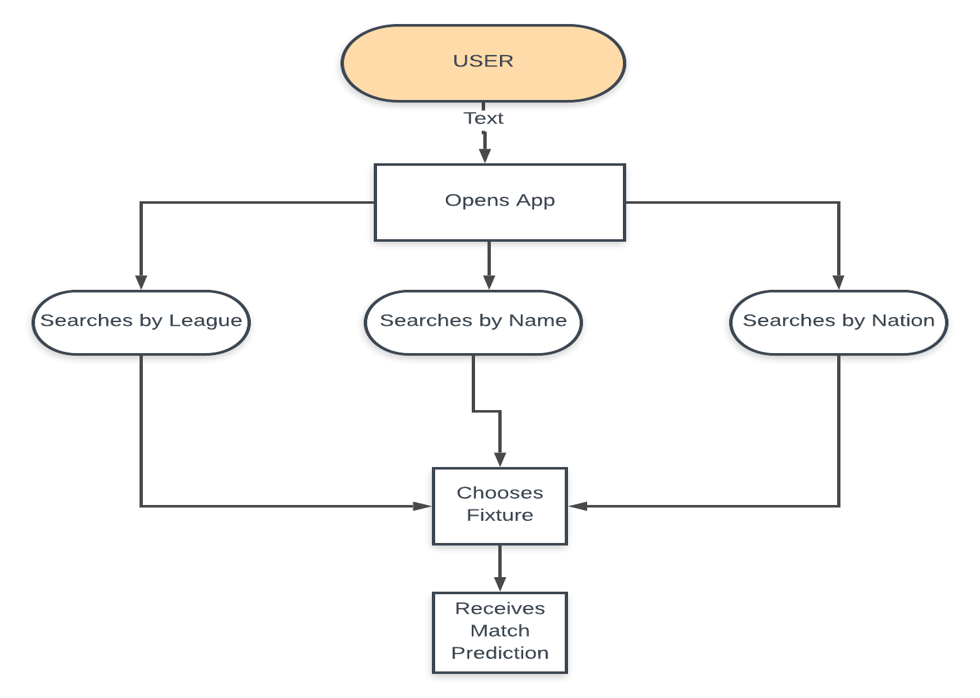
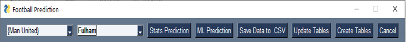

<h1>Concept</h1>

A prediction application to determine the outcome of future football fixtures
Utilizes previous game statistics combined with machine learning to predict an outcome.

<h1>Why am I developing this application?</h1>

There is a gap in the market for technology like such. There are some available but none well-known. For example www.gamastack.com and www.pronxcalcio.com.
The Sports Betting industry is growing and growing, these sort of tools could assist punters in their betting. 

<h1>Technologies</h1>

Application functionality is currently being developed in Python using a mySQL database.
The application uses an API from rapidapi.com in order to receive up-to-date data required by this application.

The end goal is to deploy this application as a mobile application with the help of ionic framework.

<h1>Plan</h1>

<h1>Data</h1>
SQL table structure

Json Data Structure returned by API

<h1>Architecture</h1>

<h1>Use Case Diagram</h1>

<h1>User Interface</h1>

Here we have the UI for the application. It contains a combo box for selecting home and away teams. Also included
is buttons to save tables to .csv dataset. Buttons also to update and create SQL tables in Database. Each of these functions require 20 API calls per table.

<h1>Dataset</h1>

Here we have an example of a dataset that is used for the Machine Learning aspect of the project

<h1>Statistical Analysis</h1>

Demonstrated here is a chart drawn by the Statistical Analysis Function of the program. 

<h1>Machine Learning</h1>
Once all data is gathered by the application, the application will need to utilize a machine learning algorithm in order to predict an outcome to a fixture.
The planned approach is to predict match outcomes using Logistic Regression with Python with some aid from a Conference Paper on researchgate.com among some other resources found on towardsdatascience
Logistic Regression develops a predictive model when the dependent variable is dichotomous and independent variables are categorical. i.e Event of winning in a match based on metrics such as Wins/Losses.

