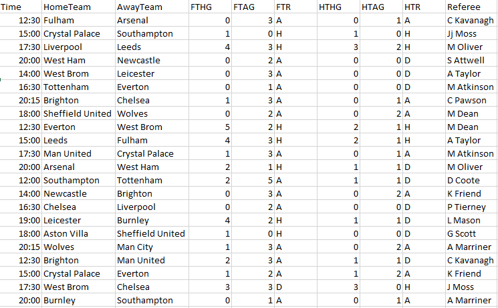

<h1>Concept</h1>

A prediction application to determine the outcome of future football fixtures
Utilizes previous game statistics combined with machine learning to predict an outcome.

<h1>Why am I developing this application?</h1>

There is a gap in the market for technology like such. There are some available but none well-known. For example www.gamastack.com and www.pronxcalcio.com.
The Sports Betting industry is growing and growing, these sort of tools could assist punters in their betting. 

<h1>Technologies</h1>

Application functionality is currently being developed in Python using a mySQL database.
The application uses an API from rapidapi.com in order to receive up-to-date data required by this application.

The end goal is to deploy this application as a mobile application with the help of ionic framework.

<h1>Dataset</h1>

